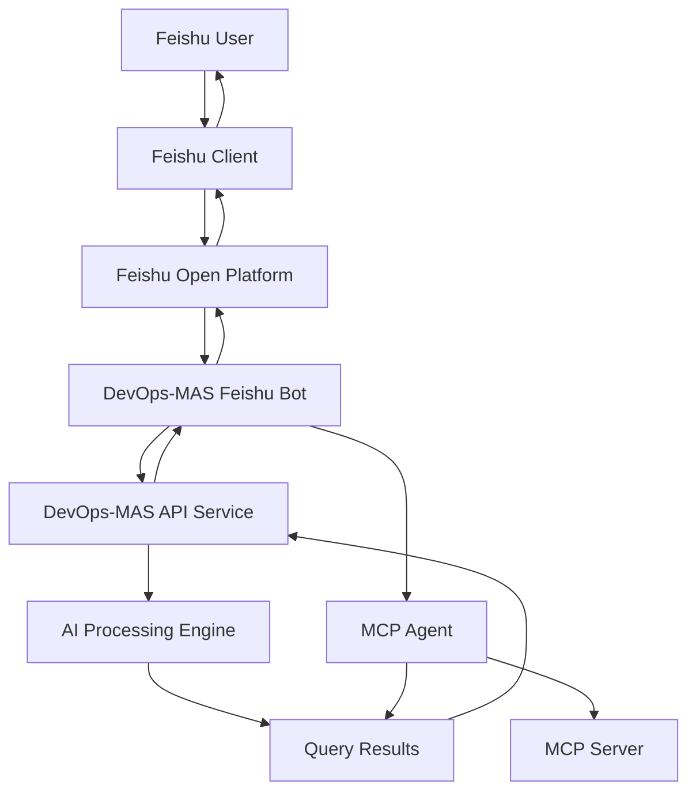

# DevOps-MAS Feishu Integration Guide

## Overview

DevOps-MAS Feishu integration allows you to use DevOps-MAS's powerful AI query capabilities directly within Feishu, including document analysis, technical problem diagnosis, and MCP tool integration.

## Features

### 🤖 Core Functionality
- **Intelligent Q&A**: Ask AI questions directly in Feishu
- **Document Analysis**: Upload files for AI analysis
- **Problem Diagnosis**: Technical problem analysis and solutions
- **MCP Integration**: Use Model Context Protocol tools for deep analysis
- **Real-time Response**: Asynchronous processing ensures fast responses

### 💬 Supported Commands
| Command | Function | Example |
|---------|----------|---------|
| `/help` | Show help information | `/help` |
| `/query <question>` | AI intelligent Q&A | `/query How to optimize MySQL performance?` |
| `/analyze <description>` | Technical problem analysis | `/analyze Server CPU usage too high` |
| `/mcp <question>` | MCP tool analysis | `/mcp Analyze log file error patterns` |
| `/debug` | System status debugging | `/debug` |
| `/status` | Service running status | `/status` |

## Quick Deployment

### Step 1: Prepare Environment

Ensure DevOps-MAS is running properly:

```bash
# Navigate to DevOps-MAS directory
cd /path/to/DevOps-MAS

# Start DevOps-MAS service
./setup_environment.sh

# Or start manually
python server.py --host 127.0.0.1 --port 8080
```

Verify service status:
```bash
curl http://127.0.0.1:8080/health
```

### Step 2: Configure Feishu Application

1. **Login to Feishu Open Platform**: https://open.feishu.cn/

2. **Create Enterprise Self-built Application**:
   - Application Name: `DevOps-MAS Bot`
   - Application Type: Bot
   - Application Description: Intelligent technical Q&A bot

3. **Get Application Credentials**:
   - App ID: `cli_xxxxxxxxxxxxxxxxx`
   - App Secret: `xxxxxxxxxxxxxxxxxxxxxxxxxxxxxxxx`
   - Verification Token: `xxxxxxxxxxxxxxxxxxxxxxxxxxxxxxxx`

4. **Configure Application Permissions**:
   - ✅ Read messages sent to bot in private chats
   - ✅ Read messages mentioning bot in group chats
   - ✅ Send and receive private chat and group messages
   - ✅ File read permissions (for document analysis)

5. **Set Event Callback**:
   - Callback URL: `https://your-domain.com/feishu/callback`
   - Subscribe to events: `im.message.receive_v1`

### Step 3: Configure Environment Variables

```bash
# Copy configuration example
cd DevOps-MAS/tutorials
cp config.py.example config.py

# Edit configuration file
nano config.py
```

Fill in actual configuration:
```python
# Feishu Bot Configuration
FEISHU_APP_ID = "cli_xxxxxxxxxxxxxxxxx"
FEISHU_APP_SECRET = "xxxxxxxxxxxxxxxxxxxxxxxxxxxxxxxx"
FEISHU_VERIFICATION_TOKEN = "xxxxxxxxxxxxxxxxxxxxxxxxxxxxxxxx"
DEVOPS_MAS_URL = "http://127.0.0.1:8080"
```

### Step 4: Start Feishu Bot

```bash
# Start Feishu bot
python feishu_bot.py
```

### Step 5: Verify Deployment

```bash
# Check service status
curl http://127.0.0.1:8082/health
curl http://127.0.0.1:8082/status

# Test in Feishu
@DevOps-MAS Bot /help
@DevOps-MAS Bot /status
```

## Detailed Configuration

### Environment Variables

#### Required Configuration
```python
# Feishu application credentials (required)
FEISHU_APP_ID = "cli_xxxxxxxxxxxxxxxxx"
FEISHU_APP_SECRET = "xxxxxxxxxxxxxxxxxxxxxxxxxxxxxxxx"
FEISHU_VERIFICATION_TOKEN = "xxxxxxxxxxxxxxxxxxxxxxxxxxxxxxxx"
```

#### Optional Configuration
```python
# Service configuration
FEISHU_BOT_HOST = "0.0.0.0"              # Listen address
FEISHU_BOT_PORT = 8082                   # Listen port
DEVOPS_MAS_URL = "http://127.0.0.1:8080"  # DevOps-MAS address

# Feature configuration
MAX_MESSAGE_LENGTH = 4000                # Maximum message length
MCP_ENABLED = True                       # Enable MCP functionality
ENABLE_SIGNATURE_VERIFICATION = True     # Enable signature verification
```

### Reverse Proxy Configuration

If external access is needed, using Nginx reverse proxy is recommended:

```nginx
server {
    listen 80;
    server_name your-domain.com;

    location /feishu/ {
        proxy_pass http://127.0.0.1:8082;
        proxy_set_header Host $host;
        proxy_set_header X-Real-IP $remote_addr;
        proxy_set_header X-Forwarded-For $proxy_add_x_forwarded_for;
        proxy_set_header X-Forwarded-Proto $scheme;
        
        # Timeout configuration
        proxy_connect_timeout 60s;
        proxy_send_timeout 60s;
        proxy_read_timeout 300s;
    }
}
```

## Usage Guide

### Basic Usage

1. **Add bot to group chat**:
   Search for `DevOps-MAS Bot` in Feishu and add to group chat

2. **View help information**:
   ```
   @DevOps-MAS Bot /help
   ```

3. **Technical Q&A**:
   ```
   @DevOps-MAS Bot /query How to resolve Redis connection timeout issues?
   ```

4. **Problem analysis**:
   ```
   @DevOps-MAS Bot /analyze Database query performance degradation
   ```

### Advanced Features

#### Document Analysis
1. Upload document files (supports .txt, .md, .pdf, .doc, .docx, etc.)
2. Send analysis command:
   ```
   @DevOps-MAS Bot /analyze Analyze this error log
   ```

#### MCP Tool Analysis
```
@DevOps-MAS Bot /mcp Analyze system performance bottlenecks
```

#### System Diagnostics
```
@DevOps-MAS Bot /debug
@DevOps-MAS Bot /status
```

### Best Practices

1. **Clear Questions**: Use specific, clear problem descriptions
2. **Provide Context**: Upload relevant files or provide detailed background information
3. **Step by Step**: Complex problems can be broken down into multiple simple questions
4. **Be Patient**: AI analysis may take a few minutes

## Architecture Overview

### System Architecture



### Key Components

1. **feishu_bot.py**: Core Feishu bot processor
2. **config.py**: Configuration management system
3. **DevOps-MAS API**: Local AI service interface
4. **MCP Integration**: Model Context Protocol integration

### Data Flow

1. User sends message in Feishu
2. Feishu platform forwards to callback URL
3. Feishu bot parses message and commands
4. Calls DevOps-MAS API or MCP Agent
5. Processes results and returns to Feishu

## Troubleshooting

### Common Issues

#### 1. Callback Verification Failed
```bash
# Check URL accessibility
curl -I https://your-domain.com/feishu/callback

# Check firewall settings
sudo ufw status
sudo ufw allow 8082
```

#### 2. DevOps-MAS Connection Failed
```bash
# Check service status
ps aux | grep server
netstat -tlnp | grep 8080

# Restart service
cd /path/to/DevOps-MAS
python server.py --host 127.0.0.1 --port 8080
```

#### 3. Message Sending Failed
```bash
# Check application credentials
echo $FEISHU_APP_ID
echo $FEISHU_APP_SECRET

# Test token acquisition
curl -X POST "https://open.feishu.cn/open-apis/auth/v3/tenant_access_token/internal" \
  -H "Content-Type: application/json" \
  -d "{\"app_id\":\"$FEISHU_APP_ID\",\"app_secret\":\"$FEISHU_APP_SECRET\"}"
```

### Debugging Tools

#### View Logs
```bash
# Feishu bot logs
python3 feishu_bot.py 2>&1 | tee feishu_bot.log

# DevOps-MAS logs
tail -f /path/to/DevOps-MAS/logs/server.log
```

#### Health Check Script
```bash
#!/bin/bash
# health_check.sh

echo "=== DevOps-MAS Health Check ==="
curl -s http://127.0.0.1:8080/health || echo "❌ DevOps-MAS unavailable"

echo "=== Feishu Bot Health Check ==="
curl -s http://127.0.0.1:8082/health || echo "❌ Feishu bot unavailable"

echo "=== Function Status Check ==="
curl -s http://127.0.0.1:8082/status || echo "❌ Status check failed"
```

## Development Extensions

### Adding New Commands

Extend commands in `feishu_bot.py`:

```python
async def handle_custom_command(self, chat_id: str, user_id: str, args: list) -> str:
    """Handle custom commands"""
    # Implement custom logic
    return "Custom command result"

# Add command during initialization
self.commands['/custom'] = self.handle_custom_command
```

### Integrating Other Services

```python
async def call_external_service(self, query: str) -> Dict[str, Any]:
    """Call external service"""
    try:
        async with aiohttp.ClientSession() as session:
            async with session.post('http://external-service/api', json={'query': query}) as response:
                return await response.json()
    except Exception as e:
        return {"success": False, "error": str(e)}
```

## Performance Optimization

### Asynchronous Processing
- Use `asyncio` for handling concurrent requests
- Non-blocking message processing
- Connection pool reuse

### Caching Mechanism
- Token caching to reduce API calls
- Query result caching
- File download caching

### Monitoring and Alerting
- Integrate Prometheus monitoring
- Log analysis and alerting
- Performance metrics tracking

## Security Considerations

### Signature Verification
- Enable Feishu callback signature verification
- Verify legitimacy of request sources

### Access Control
- IP whitelist restrictions
- User permission management
- Sensitive information filtering

### Data Protection
- Encrypted message content transmission
- File upload security checks
- User privacy protection

---

## Summary

Through DevOps-MAS Feishu integration, you can:

✅ **Use AI Q&A functionality directly in Feishu**  
✅ **Upload documents for intelligent analysis**  
✅ **Get professional technical problem solutions**  
✅ **Use powerful MCP tool sets**  
✅ **Enjoy real-time responsive user experience**  

This provides a powerful AI assistant for team collaboration and technical support!

**Technical Support**: rwlinno@gmail.com  
**Project Repository**: https://github.com/rwlinno/DevOps-MAS